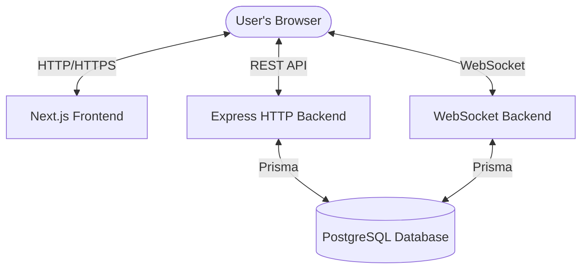

# System Architecture

This document describes the high-level architecture of the DrawIt application.

## 🏗 High-Level Overview

DrawIt is a distributed system consisting of three main services and several shared packages.

## 🛠 Services

### 1. Frontend (`apps/web`)
- **Framework**: Next.js 15
- **Purpose**: Provides the user interface, canvas drawing logic, and user authentication management.
- **Key Components**:
    - **Canvas**: Custom drawing logic that handles shapes, pencil strokes, and canvas rendering.
    - **API Clients**: Handles communication with the HTTP and WebSocket backends.

### 2. HTTP Backend (`apps/http-backend`)
- **Framework**: Express.js
- **Purpose**: Handles user authentication, room management, and retrieval of chat/shape history.
- **Endpoints**:
    - `/api/v1/signup`: Creates a new user account.
    - `/api/v1/signin`: Authenticates user and returns a JWT.
    - `/api/v1/room`: Creates and manages drawing rooms.
    - `/api/v1/chats/:roomId`: Retrieves previous drawing strokes/messages for a room.

### 3. WebSocket Backend (`apps/ws-backend`)
- **Framework**: `ws` (Node.js WebSocket library)
- **Purpose**: Facilitates real-time communication between users in the same drawing room.
- **Functionality**:
    - **Room Joining**: Users join rooms identified by `roomId`.
    - **State Broadcast**: When a user draws a shape, it is broadcasted to all other users in the same room.
    - **Persistence**: Drawing strokes are saved to the database for future retrieval.

### 4. Database (`packages/db`)
- **Database**: PostgreSQL
- **ORM**: Prisma
- **Models**:
    - `User`: Stores user credentials and profile info.
    - `Room`: Stores drawing room details.
    - `Chat`: Stores individual drawing strokes and messages.

## 🔄 Data Flow

### Collaborative Drawing Flow
1. **Connect**: User opens a room and connects to the WebSocket server with a JWT.
2. **Retrieve State**: Frontend fetches existing shapes from the HTTP Backend (`/api/v1/chats/:roomId`) and renders them on the canvas.
3. **Action**: User draws a shape (e.g., a rectangle).
4. **Emit**: Frontend sends a JSON message over WebSocket: `{ type: "chat", roomId: 1, message: "{...shapeData...}" }`.
5. **Process**:
    - WS Backend saves the shape to the database.
    - WS Backend broadcasts the message to all other users in `roomId`.
6. **Render**: Other users' frontends receive the message and render the new shape on their canvas.

## 🔐 Authentication & Security

- **JWT**: All requests to the HTTP and WebSocket backends require a valid JSON Web Token.
- **Room Authorization**: (Current implementation) Users can join any room they know the slug for. Future: Access control for room admins.
- **Input Validation**: `Zod` is used throughout the backend to ensure data integrity.
