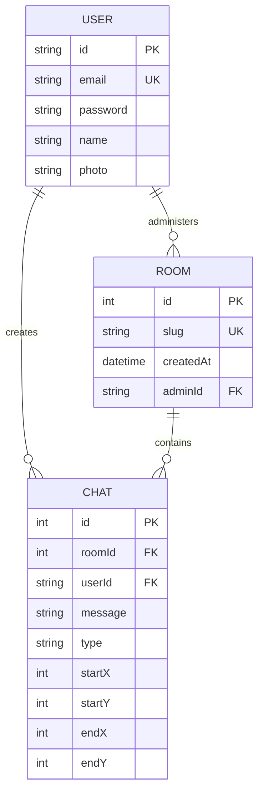

# Database Schema Documentation

DrawIt uses a PostgreSQL database managed by Prisma. The schema is defined in `packages/db/prisma/schema.prisma`.

## 📊 Entity Relationship Summary

The schema centers around Users, Rooms, and Chats (which represent drawing actions).

## 🗃 Table Definitions

### `User`
Stores core user information and credentials.
- `id`: Unique identifier (UUID).
- `email`: User's login email.
- `password`: Hashed password.
- `name`: User's display name.
- `photo`: Optional profile picture URL.

### `Room`
Represents a drawing workspace.
- `id`: Auto-incrementing primary key.
- `slug`: Human-readable identifier used in URLs.
- `createdAt`: Timestamp of creation.
- `adminId`: Reference to the `User` who created the room.

### `Chat`
Represents a single drawing action or a message sent in a room.
- `id`: Auto-incrementing primary key.
- `roomId`: Reference to the `Room`.
- `userId`: Reference to the `User` who performed the action.
- `message`: Stringified JSON containing shape-specific data.
- `type`: Type of action (e.g., "pencil", "rect", "circle").
- `startX`, `startY`: Coordinates for the start of the shape.
- `endX`, `endY`: Coordinates for the end of the shape.

## ⚙️ Prisma Configuration

- **Generator**: `prisma-client-js`
- **Datasource**: PostgreSQL (via `DATABASE_URL` env var)
- **Client Export**: The generated client is exported from `packages/db/src/index.ts`.
